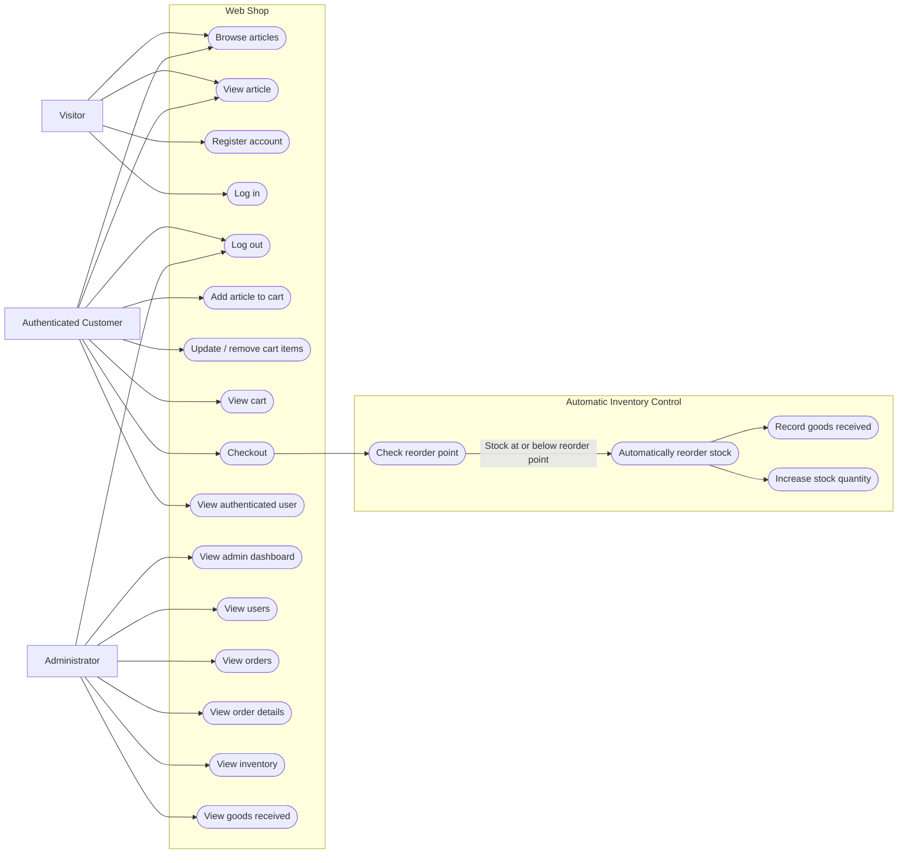
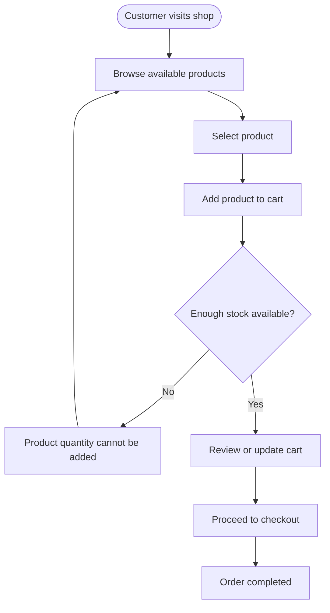
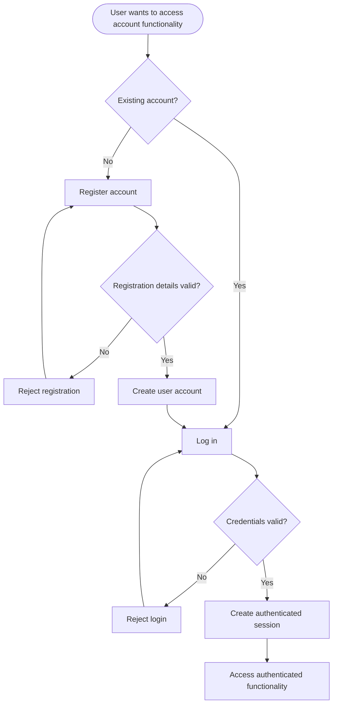
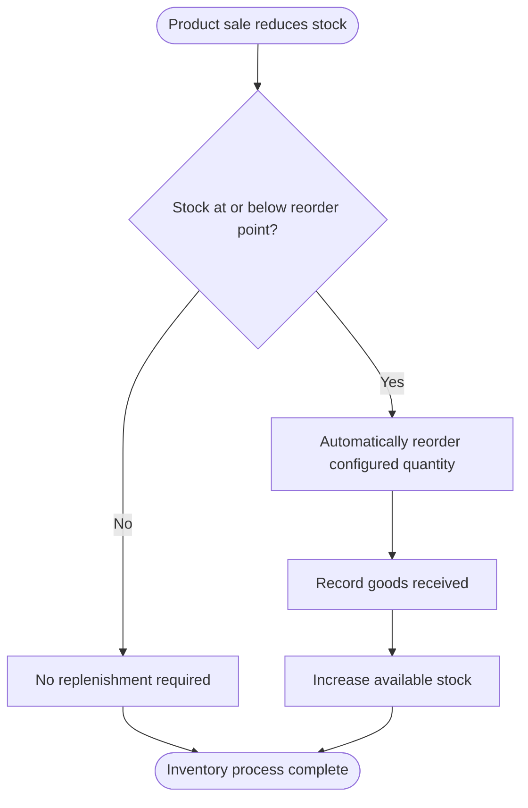
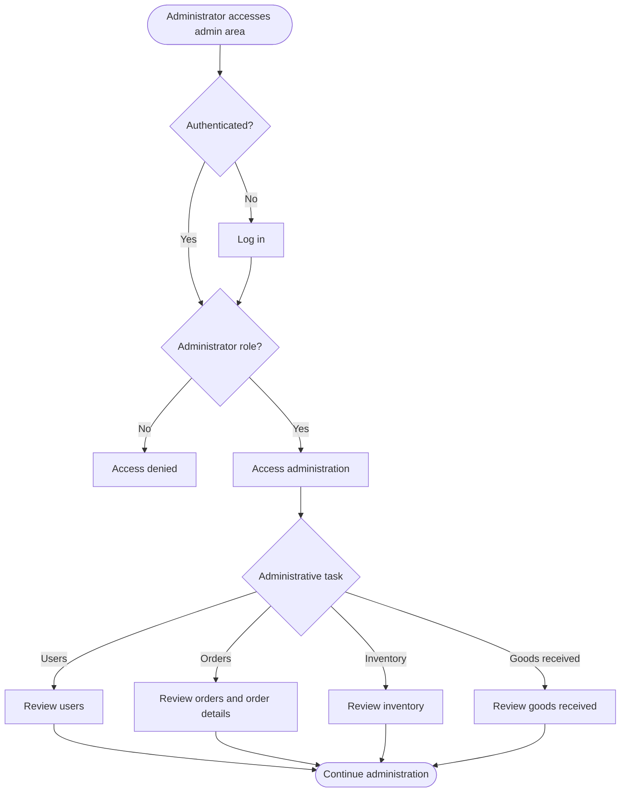

# Projektdokumentation

## Use case

```mermaid
flowchart LR
    Visitor["Visitor"]
    Customer["Authenticated Customer"]
    Admin["Administrator"]

    subgraph Shop["Web Shop"]
        Browse(["Browse articles"])
        ViewArticle(["View article"])
        Register(["Register account"])
        Login(["Log in"])
        Logout(["Log out"])

        AddCart(["Add article to cart"])
        UpdateCart(["Update / remove cart items"])
        ViewCart(["View cart"])
        Checkout(["Checkout"])

        ViewOwnAccount(["View authenticated user"])

        AdminDashboard(["View admin dashboard"])
        ManageUsers(["View users"])
        ViewOrders(["View orders"])
        ViewOrderDetails(["View order details"])
        ViewInventory(["View inventory"])
        ViewGoodsReceived(["View goods received"])
    end

    subgraph InventorySystem["Automatic Inventory Control"]
        CheckStock(["Check reorder point"])
        Reorder(["Automatically reorder stock"])
        RecordGoods(["Record goods received"])
        IncreaseStock(["Increase stock quantity"])
    end

    Visitor --> Browse
    Visitor --> ViewArticle
    Visitor --> Register
    Visitor --> Login

    Customer --> Browse
    Customer --> ViewArticle
    Customer --> AddCart
    Customer --> UpdateCart
    Customer --> ViewCart
    Customer --> Checkout
    Customer --> ViewOwnAccount
    Customer --> Logout

    Admin --> AdminDashboard
    Admin --> ManageUsers
    Admin --> ViewOrders
    Admin --> ViewOrderDetails
    Admin --> ViewInventory
    Admin --> ViewGoodsReceived
    Admin --> Logout

    Checkout --> CheckStock
    CheckStock -->|Stock at or below reorder point| Reorder
    Reorder --> RecordGoods
    Reorder --> IncreaseStock
```

## Procesdiagrammer

### Customer purchase

```mermaid
flowchart TD
    Start([Customer visits shop])

    Browse["Browse available products"]

    Select["Select product"]

    Add["Add product to cart"]

    Stock{Enough stock available?}

    Reject["Product quantity cannot be added"]

    Cart["Review or update cart"]

    Checkout["Proceed to checkout"]

    Order["Order completed"]

    Start --> Browse
    Browse --> Select
    Select --> Add
    Add --> Stock

    Stock -->|No| Reject
    Stock -->|Yes| Cart

    Reject --> Browse

    Cart --> Checkout
    Checkout --> Order
```

### Authentication

```mermaid
flowchart TD
    Start([User wants to access account functionality])

    Choice{Existing account?}

    Register["Register account"]

    ValidateRegistration{Registration details valid?}

    RegistrationError["Reject registration"]

    StoreUser["Create user account"]

    Login["Log in"]

    ValidateCredentials{Credentials valid?}

    LoginError["Reject login"]

    Authenticate["Create authenticated session"]

    Access["Access authenticated functionality"]

    Start --> Choice

    Choice -->|No| Register
    Choice -->|Yes| Login

    Register --> ValidateRegistration

    ValidateRegistration -->|No| RegistrationError
    ValidateRegistration -->|Yes| StoreUser

    RegistrationError --> Register
    StoreUser --> Login

    Login --> ValidateCredentials

    ValidateCredentials -->|No| LoginError
    ValidateCredentials -->|Yes| Authenticate

    LoginError --> Login

    Authenticate --> Access
```

### Inventory

```mermaid
flowchart TD
    Start([Product sale reduces stock])

    Check{Stock at or below reorder point?}

    NoAction["No replenishment required"]

    Reorder["Automatically reorder configured quantity"]

    Receive["Record goods received"]

    Replenish["Increase available stock"]

    End([Inventory process complete])

    Start --> Check

    Check -->|No| NoAction
    Check -->|Yes| Reorder

    Reorder --> Receive
    Receive --> Replenish

    NoAction --> End
    Replenish --> End
```

### Admin

```mermaid
flowchart TD
    Start([Administrator accesses admin area])

    Authenticate{Authenticated?}

    Login["Log in"]

    Role{Administrator role?}

    Reject["Access denied"]

    Dashboard["Access administration"]

    Action{
        Administrative task
    }

    Users["Review users"]

    Orders["Review orders and order details"]

    Inventory["Review inventory"]

    Goods["Review goods received"]

    End([Continue administration])

    Start --> Authenticate

    Authenticate -->|No| Login
    Authenticate -->|Yes| Role

    Login --> Role

    Role -->|No| Reject
    Role -->|Yes| Dashboard

    Dashboard --> Action

    Action -->|Users| Users
    Action -->|Orders| Orders
    Action -->|Inventory| Inventory
    Action -->|Goods received| Goods

    Users --> End
    Orders --> End
    Inventory --> End
    Goods --> End
```